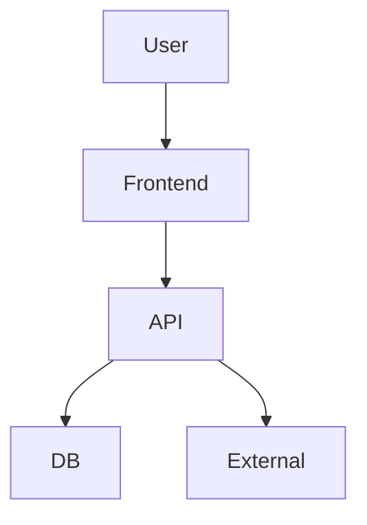

# Architecture — Template

> Géré par `SOFTWARE_ARCHITECT_AGENT`. Miroir de `architecture/*.md`.

## 1. Tech Stack
| Layer | Choice | Justification |
|---|---|---|
| Frontend | Next.js 14 + TS + Tailwind | SSR, perf, DX |
| Backend |  |  |
| DB | PostgreSQL + Prisma |  |
| Mobile | Expo |  |
| Auth |  |  |
| Infra | Docker + GH Actions |  |

## 2. Diagramme (Mermaid)

## 3. API Contract
Voir `architecture/api.md`

## 4. Modèle de données
Voir `architecture/database.md`

## 5. Sécurité
Voir `architecture/security.md`

## 6. Décisions (ADRs)
Voir `.ai/project/decisions.md`
