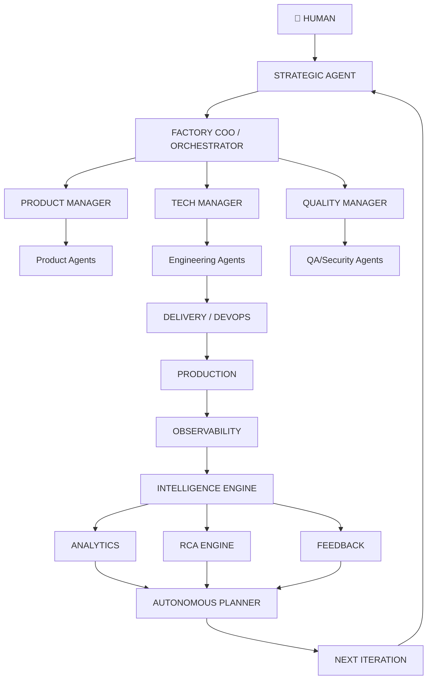

# WF-V3 : Autonomous AI Software Factory

> **Vision** : La V3 doit être un changement de paradigme. La V1 était une équipe d'agents. La V2 est devenue une Software Factory orchestrée. La V3 doit devenir une **organisation logicielle agentique autonome**, capable de fonctionner en boucle à partir d'objectifs métier, de mesurer les résultats, de détecter les problèmes et de relancer elle-même les cycles d'amélioration.

---

## Table des matières

1. [Architecture globale V3](#1-architecture-globale-v3)
2. [La boucle autonome complète](#2-la-boucle-autonome-complete)
3. [Nouveau paradigme : Objectifs vs Tâches](#3-nouveau-paradigme-objectifs-vs-tâches)
4. [Couche stratégique : STRATEGIC_AGENT](#4-couche-stratégique-strategic_agent)
5. [Orchestrateur → FACTORY_COO_AGENT](#5-orchestrateur--factory_coo_agent)
6. [Système d'initiatives (Hiérarchie de travail)](#6-système-dinitiatives-hiérarchie-de-travail)
7. [Système de feedback continu](#7-système-de-feedback-continu)
8. [Agents d'observabilité et d'analyse](#8-agents-dobservabilité-et-danalyse)
   - [OBSERVABILITY_AGENT](#observability_agent)
   - [ROOT_CAUSE_ANALYSIS_AGENT](#root_cause_analysis_agent)
9. [Système d'auto-réparation (SELF_HEALING_ENGINE)](#9-système-dauto-réparation-self_healing_engine)
10. [INCIDENT_MANAGER_AGENT](#10-incident_manager_agent)
11. [Apprentissage par les erreurs & POLICY_AGENT](#11-apprentissage-par-les-erreurs--policy_agent)
12. [Auto-planification des sprints & SPRINT_MANAGER_AGENT](#12-auto-planification-des-sprints--sprint_manager_agent)
13. [Système d'auto-évaluation & AGENT_EVALUATION_AGENT](#13-système-dauto-évaluation--agent_evaluation_agent)
14. [Routage dynamique des agents](#14-routage-dynamique-des-agents)
15. [Allocation dynamique des ressources](#15-allocation-dynamique-des-ressources)
16. [Orchestration multi-projets & PORTFOLIO_MANAGER_AGENT](#16-orchestration-multi-projets--portfolio_manager_agent)
17. [Système de simulation & SIMULATION_AGENT](#17-système-de-simulation--simulation_agent)
18. [Jumeau numérique : DIGITAL_TWIN_AGENT](#18-jumeau-numérique--digital_twin_agent)
19. [Architecture des composants (Structure de fichiers)](#19-architecture-des-composants-structure-de-fichiers)
20. [Récapitulatif V2 → V3](#20-récapitulatif-v2--v3)

---

## 1. Architecture globale V3



### Trois systèmes principaux

| Système | Responsable | Rôle |
|---------|-------------|------|
| **Product System** | Product Manager → Product Agents | Découverte, specification, priorisation métier |
| **Engineering System** | Tech Manager → Dev Agents | Architecture, développement, livraison technique |
| **Quality System** | Quality Manager → QA/Security Agents | Tests, sécurité, conformité, observabilité |

---

## 2. La boucle autonome complète

```
┌────────────────────────────────────────┐
│                                        │
▼                                        │
OBJECTIVE                                │
   ↓                                      │
PLAN                                     │
   ↓                                      │
DESIGN                                   │
   ↓                                      │
DEVELOP                                  │
   ↓                                      │
TEST                                     │
   ↓                                      │
REVIEW                                   │
   ↓                                      │
DEPLOY                                   │
   ↓                                      │
OBSERVE                                  │
   ↓                                      │
MEASURE                                  │
   ↓                                      │
LEARN                                    │
   ↓                                      │
PRIORITIZE                               │
   ↓                                      │
IMPROVE ─────────────────────────────────┘
```

**Ce n'est plus** : une IA qui développe une application.  
**C'est** : une organisation IA qui développe, déploie, observe, maintient et améliore **continuellement** des applications.

---

## 3. Nouveau paradigme : Objectifs vs Tâches

### V1/V2 — Approche par tâches (push)
```
Utilisateur → Orchestrateur → Tâches → Agents
```

### V3 — Approche par objectifs (pull + boucle fermée)
```
Objectif → Observation → Analyse → Décision → Planification
    ↑                                                      │
    └────────────── Apprentissage ← Mesure ← Exécution ←───┘
```

**Exemple d'objectif métier** : *"Je veux augmenter l'utilisation hebdomadaire de l'application."*

Le Strategic Agent transforme en :
- **OBJECTIVE** : Increase weekly active users
- **KEY RESULTS** :
  - KR1 → Increase retention
  - KR2 → Improve onboarding
  - KR3 → Reduce crashes
  - KR4 → Improve feature discovery

---

## 4. Couche stratégique : STRATEGIC_AGENT

> Niveau supérieur à l'Orchestrateur. Réfléchit en termes business.

### Domaines de réflexion
- Objectifs business
- Produit & croissance
- Qualité & coûts
- Dette technique
- Satisfaction utilisateur
- Risques & priorités

### Flux
```
Human Objective → STRATEGIC_AGENT → Objectives + KRs → FACTORY_COO_AGENT
```

---

## 5. Orchestrateur → FACTORY_COO_AGENT

> L'Orchestrateur V2 devient un véritable **COO (Chief Operating Officer)**.

### Hiérarchie de décomposition
```
Strategic Objectives
       ↓
Initiatives
       ↓
Projects
       ↓
Epics
       ↓
Tasks
       ↓
Agents
```

**Rôle** : Transformer les objectifs stratégiques en travail opérationnel exécutable par les agents.

---

## 6. Système d'initiatives (Hiérarchie de travail)

Remplace la simple logique de task par 7 niveaux :

| Niveau | Description | Exemple |
|--------|-------------|---------|
| **Objective** | Objectif métier mesurable | Améliorer la rétention |
| **Initiative** | Programme d'amélioration majeur | Refonte onboarding |
| **Epic** | Grande fonctionnalité transversale | Nouveau parcours de bienvenue |
| **Feature** | Capacité utilisateur complète | Choix des préférences |
| **Story** | Besoin utilisateur (format user story) | "En tant qu'utilisateur, je veux..." |
| **Task** | Unité de travail technique | Créer écran onboarding |
| **Action** | Opération atomique | Créer component `PreferenceCard` |

> Cette architecture rapproche la Factory d'une vraie organisation produit.

---

## 7. Système de feedback continu

> **Composant le plus important de la V3.**

### Sources d'observation (Production)
```
Production
 ├── Logs
 ├── Errors
 ├── Performance
 ├── Analytics
 ├── User feedback
 ├── Reviews
 ├── Support tickets
 └── Business metrics
```

### Pipeline d'intelligence
```
OBSERVATION ENGINE
        ↓
ANOMALY DETECTION
        ↓
ROOT CAUSE ANALYSIS
        ↓
PRIORITIZATION
        ↓
ACTION
```

---

## 8. Agents d'observabilité et d'analyse

### OBSERVABILITY_AGENT

**Surveille** :
- Erreurs & taux de crash
- Latence & disponibilité
- Consommation CPU/mémoire
- Performances API & Frontend
- Métriques métier

**Produit** (exemple) :
```json
{
  "incident": "INC-1042",
  "severity": "high",
  "detected": true,
  "service": "payments-api",
  "symptoms": [
    "latency +180%",
    "error rate +6%"
  ],
  "recommendation": "Investigate database connection pool"
}
```

### ROOT_CAUSE_ANALYSIS_AGENT

**Corrèle** :
- Logs + Git commits + Deployments
- Metrics + Traces + Recent changes

**Exemple d'analyse** :
```
Performance degradation
         ↓
Started after deployment #842
         ↓
Deployment modifies API caching
         ↓
Cache hit rate dropped
         ↓
Root cause identified
```

> Passe de *"Il y a un problème"* → *"Voici probablement pourquoi il existe."*

---

## 9. Système d'auto-réparation (SELF_HEALING_ENGINE)

### Pipeline de remédiation
```
Incident
   ↓
Diagnosis
   ↓
Risk analysis
   ↓
Create remediation task
   ↓
Agent fixes
   ↓
Tests
   ↓
Security
   ↓
Canary / staging
   ↓
Deploy
   ↓
Verify
```

### Matrice de risque & autonomie

| Niveau de risque | Action |
|------------------|--------|
| **Low** | Automatique |
| **Medium** | Manager approval |
| **High** | Human approval |
| **Critical** | Emergency human control |

---

## 10. INCIDENT_MANAGER_AGENT

Coordonne le cycle de vie complet des incidents de production.

### Workflow
```
Incident detected
       ↓
Classify
       ↓
Assign
       ↓
Mitigate
       ↓
Repair
       ↓
Verify
       ↓
Close
       ↓
Postmortem
```

### Artefacts générés automatiquement
- Incident report
- Root cause analysis
- Timeline
- Impact assessment
- Resolution
- Preventive measures

---

## 11. Apprentissage par les erreurs & POLICY_AGENT

### V2 → V3 : De la mémoire aux politiques

**Exemple de transformation** :
```
Incident:     Migration database failed
History:      3 similar incidents detected
Pattern:      Database migrations executed without pre-deployment validation

New Policy:   All destructive migrations require:
              - backup verification
              - migration simulation
              - rollback plan
              - human approval
```

### POLICY_AGENT — Gestion des règles de la Factory

| Domaine | Exemples |
|---------|----------|
| Architecture policies | Patterns autorisés, couplage max |
| Security policies | Auth, secrets, chiffrement |
| Code policies | Standards, complexité, couverture |
| Deployment policies | Gates, canary, rollback |
| Database policies | Migrations, indexes, backup |
| Testing policies | Niveaux, contract testing, chaos |
| Compliance policies | RGPD, SOC2, audit trails |

**Exemple de politique (YAML)** :
```yaml
production_deployment:
  require:
    - tests_passed
    - security_passed
    - rollback_plan
  approval:
    risk: high
```

> L'Orchestrateur (COO) doit respecter ces politiques.

---

## 12. Auto-planification des sprints & SPRINT_MANAGER_AGENT

### Entrées du système
- Business objectives
- User feedback
- Bugs
- Tech debt
- Security
- Performance

### Sortie : Sprint planifié
```
NEXT SPRINT

Priority 1 → Fix payment errors
Priority 2 → Optimize dashboard
Priority 3 → Improve onboarding
Priority 4 → Refactor auth module
```

### Responsabilités du SPRINT_MANAGER_AGENT
- Backlog management
- Sprint planning
- Capacity planning
- Priority arbitration
- Dependency resolution
- Progress tracking
- Retrospective facilitation

### Boucle de rétrospective
```
SPRINT COMPLETE
       ↓
Retrospective Agent
       ↓
What worked? / What failed? / What should change?
       ↓
Factory improvements
```

---

## 13. Système d'auto-évaluation & AGENT_EVALUATION_AGENT

### Métriques d'évaluation par agent
| Métrique | Description |
|----------|-------------|
| Success rate | % tâches terminées sans réessai |
| Retry rate | % tâches nécessitant retry |
| Bug rate | Bugs introduits / tâches |
| Review rejection rate | % PRs rejetées en revue |
| Task duration | Temps moyen par tâche |
| Token/resource consumption | Coût d'exécution |
| Quality score | Note globale (ex: 9.1/10) |

### Exemple de rapport
```
Frontend Agent
───────────────
Tasks:        182
Success:      96.7%
Retry:         8.4%
Review pass:  94.1%
Quality:       9.1/10

Backend Agent
───────────────
High retry rate on API tasks
→ Recommendation: increase API specification validation

QA Agent
───────────────
Missing edge-case coverage
```

> Objectif : **identifier les points faibles**, pas punir.

---

## 14. Routage dynamique des agents

> L'Orchestrateur ne choisit plus toujours le même agent.

### Critères de sélection
- Task type
- Complexity
- Past performance
- Current workload
- Required skills

### Exemple
```
Task: Optimize PostgreSQL query

Candidates:
  Database Agent A  → Score: 8.1
  Database Agent B  → Score: 9.4  ← SELECTED
  Backend Agent     → Score: 7.8
```

---

## 15. Allocation dynamique des ressources

### Ressources gérées
- Agent capacity
- Context capacity
- Execution cost
- Parallel slots
- Model usage
- Execution time

### Arbitrage multi-projets
```
Project A = urgent      → 60% resources
Project B = normal      → 30% resources
Project C = low priority → 10% resources
```

---

## 16. Orchestration multi-projets & PORTFOLIO_MANAGER_AGENT

### Architecture
```
                    FACTORY
                       │
        ┌──────────────┼───────────────┐
        ▼              ▼               ▼
    Project A      Project B       Project C
        │              │               │
    SaaS             Mobile           API
        │              │               │
        └──────────────┼───────────────┘
                       ▼
                 SHARED AGENTS
```

### PORTFOLIO_MANAGER_AGENT — Décision d'allocation

**Question** : *"Sur quels projets devons-nous concentrer nos ressources ?"*

**Analyse** :
- Business value
- Cost
- Risk
- Urgency
- Progress
- Expected ROI
- Technical complexity

**Recommandations types** :
| Projet | Action |
|--------|--------|
| Project A | Continue |
| Project B | Accelerate |
| Project C | Pause |
| Project D | Kill |

> Rapproche la Factory du fonctionnement d'une véritable entreprise technologique.

---

## 17. Système de simulation & SIMULATION_AGENT

> Avant une décision importante, la Factory simule plusieurs scénarios.

### Exemple : Choix d'architecture
```
Option A: Monolith
Option B: Microservices
Option C: Modular monolith

Comparaison:
  Cost | Performance | Complexity | Scalability | Security | Maintenance
─────┼─────────────┼────────────┼─────────────┼──────────┼────────────
  A  |     ●●      |    ●●●     |      ●      |   ●●●    |    ●●●
  B  |     ●●●●    |    ●       |    ●●●●     |   ●●     |    ●
  C  |     ●●●     |    ●●      |    ●●●      |   ●●●    |    ●●

Recommandation: OPTION C (Confidence: 87%)
```

---

## 18. Jumeau numérique : DIGITAL_TWIN_AGENT

Maintient une **représentation logique complète** du système :

```
Frontend
   ↓
API
   ↓
Services
   ↓
Database
   ↓
Infrastructure
```

**Utilité** : Chaque changement peut être analysé (impact, risques, coûts) **avant** d'être appliqué.

---

## 19. Architecture des composants (Structure de fichiers)

```
.ai-factory/
│
├── core/
│   ├── orchestrator/
│   ├── planner/
│   ├── scheduler/
│   ├── state-machine/
│   ├── policy-engine/
│   ├── decision-engine/
│   └── risk-engine/
│
├── agents/
│   ├── strategic/
│   ├── product/
│   ├── architecture/
│   ├── engineering/
│   ├── qa/
│   ├── security/
│   ├── devops/
│   ├── observability/
│   ├── incident/
│   └── analytics/
│
├── intelligence/
│   ├── memory/
│   ├── knowledge/
│   ├── learning/
│   ├── evaluation/
│   └── simulation/
│
├── projects/
├── workflows/
├── policies/
├── incidents/
├── metrics/
└── dashboard/
```

---

## 20. Récapitulatif V2 → V3

| V2 (Actuel) | V3 (Vision) |
|-------------|-------------|
| Orchestration | **Autonomie** |
| Tasks | **Objectives + Initiatives** |
| Agents | **Agents + Managers + Strategic layer** |
| Planning | **Autonomous planning** |
| Tests | **Continuous verification** |
| Monitoring | **Observability intelligence** |
| Errors | **Self-healing** |
| Memory | **Learning system** |
| Backlog | **Autonomous backlog management** |
| Sprint | **Autonomous sprint planning** |
| Review | **Continuous evaluation** |
| One project | **Portfolio management** |
| Fixed routing | **Dynamic agent routing** |
| Human approval | **Risk-based autonomy** |
| Deployment | **Continuous operation** |
| Factory executes | **Factory learns** |

---

*Document vivant — à faire évoluer au fil de l'implémentation V3.*