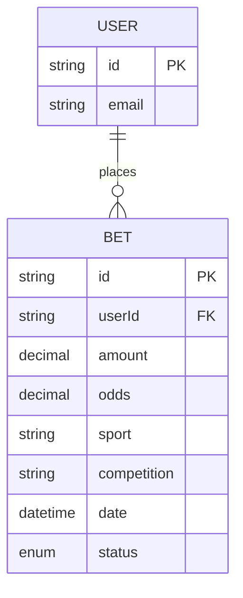

# Database — Template

> Géré par DATABASE_ARCHITECT_AGENT

```mermaid
erDiagram
  USER ||--o{ BET : places
  USER {
    string id PK
    string email
  }
  BET {
    string id PK
    string userId FK
    decimal amount
    decimal odds
    string sport
    string competition
    datetime date
    enum status
  }
```
